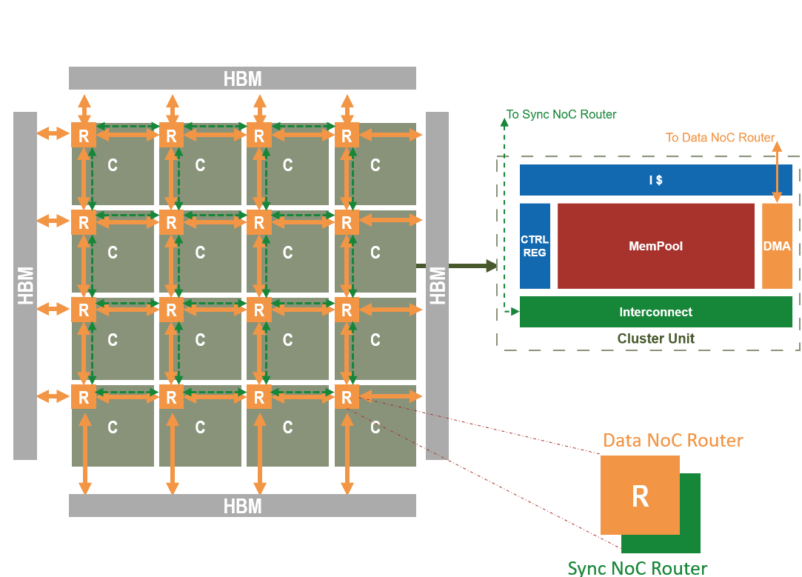

# SoftHier (x MemPool) Simulation Model in GVSoC 🚀

## Attention

**This is the tmp branch only for dev purpose.*
*
## SoftHier Architecture Overview 🏗️



## OS Requirements Installation 🖥️

The following instructions are designed for a fresh installation of Ubuntu 22.04 (Jammy Jellyfish).

To install the required packages, run:

```bash
sudo apt-get install -y build-essential git doxygen python3-pip libsdl2-dev curl cmake gtkwave libsndfile1-dev rsync autoconf automake texinfo libtool pkg-config libsdl2-ttf-dev
```

## Toolchain and Shell Requirements 🔧

GVSoC requires the following tools and versions:

- **g++** and **gcc** versions >= 11.2.0
- **cmake** version >= 3.18.1
- **Python** version >= 3.11.3

Please ensure your toolchain meets these requirements. 

Also please make sure you are using the bash shell for SoftHier Simulation:

```bash
bash
```

## Getting Started with SoftHier Simulation 🚀

### Clone the Repository and Set Up the Environment 🏁

Follow these steps to set up the SoftHier simulation environment:

1. **Clone the repository** and navigate into the project directory:

   ```bash
   git clone https://github.com/Valegrl/gvsoc.git -b soft_hier_mempool soft_hier_mempool
   cd soft_hier_mempool
   ```

2. **Initialize the simulator environment** by running:

   ```bash
   source sourceme.sh
   ```

### Build and Run the SoftHier Simulation Model 🧱

**Build the SoftHier hardware model**: 🛠️

   ```bash
   make hw
   ```
The default configuration file is located at `soft_hier/flex_cluster/flex_cluster_arch.py` and builds the **Mempool** preset (256 cores/cluster). To use a custom architecture configuration, specify the file path as follows:

   ```bash
   cfg=<path/to/your/architecture/configuration/file> make hw
   ```

   Three ready-made Mempool-family presets ship in `soft_hier/flex_cluster/configs/`:

   ```bash
   # Minpool (16 cores/cluster)
   cfg=soft_hier/flex_cluster/configs/arch_minpool.py  make hw

   # Mempool (256 cores/cluster) -- same as the default
   cfg=soft_hier/flex_cluster/configs/arch_mempool.py  make hw

   # Terapool (1024 cores/cluster)
   cfg=soft_hier/flex_cluster/configs/arch_terapool.py make hw
   ```

   The same `cfg=` switch works with the `hs` target below; the Makefile auto-derives the matching Mempool SW `config=` (minpool/mempool/terapool) from the `cfg=` filename, so `-DNUM_CORES` etc. are forwarded to the CMake SW build automatically. When swapping presets after an earlier build, also rebuild the software (`make sw` / `make hs`) so the binary's sizes match the newly configured HW -- otherwise the linker may reuse stale `arch.ld` values from the previous preset.


### Build the Default Binary 💾
To build the default binary (default Mempool) from the source code in `soft_hier/flex_cluster_sdk/app_example`, run:
   ```bash
   make sw
   # Presets:
   # make config=mempool sw
   # make config=minpool sw
   # make config=terapool sw
   ```
The generated binary `sw_build/softhier.elf` and the dump file `sw_build/softhier.dump` will be located in the `sw_build` directory.

### Build a Custom Binary ✏️
To build your own binary:

1. Prepare your source code in a folder with a `CMakeLists.txt` that defines the source files and include paths. For example:
   ```cmake
   # CMakeLists.txt example
   set(SRC_SOURCES
       ${CMAKE_CURRENT_SOURCE_DIR}/main.c
   )
   
   set(SOURCES ${SRC_SOURCES} PARENT_SCOPE)
   set(INCLUDE_DIRS ${CMAKE_CURRENT_SOURCE_DIR}/include PARENT_SCOPE)
   ```

2. Run the following command, replacing `<folder/of/your/code>` with the path to your source code folder:
   ```bash
   app=<folder/of/your/code> make sw
   ```

This will compile the binary using the specified folder. The generated binary `sw_build/softhier.elf` and the dump file `sw_build/softhier.dump` will be located in the `sw_build` directory.

3. **Run the simulation** with an example binary: 🎮

   ```bash
   ./install/bin/gvsoc --target=pulp.chips.flex_cluster.flex_cluster --binary examples/SoftHier/binary/example.elf run --trace=/chip/cluster_0 --preload=my_preload.elf
   ```

   - `--binary`: Specifies the executable binary to be loaded for the SoftHier simulation.
   - `--trace`: Indicates which component's trace logs should be generated during the simulation.
   - `--preload`: Loads an additional ELF file into memory before execution (e.g., pre-initialized HBM/DRAM data).

   Or run sw_build/softhier.elf through Makefile:

   ```bash
   pld=my_preload.elf make run 
   ```

   - `pld` is equivalent to `--preload` when executing directly.

   **Generating HBM Preload Data**
   To generate an HBM preload binary from NumPy data, run:
   ```bash
   python soft_hier/flex_cluster_sdk/tests/05_HBM_accesses/preload/gen_preload1.py
   ```
   This will create the preload binary at:
   ```
   soft_hier/flex_cluster_sdk/tests/05_HBM_accesses/preload/my_preload.py
   ```


### Build Customized Hardware and Software (Highly Recommended) 🧩

For convenient and flexible development, use the `hs` Makefile target to build both hardware and software together. This is particularly useful for custom architecture configurations and software development. Run:

```bash
cfg=<path/to/your/architecture/configuration/file> app=<folder/of/your/code> make hs
```

We provide example architecture configurations and software source code in the repository. Try the following:

#### Example 1: Hello World 🌍
```bash
cfg=soft_hier/flex_cluster/configs/arch_minpool.py app=soft_hier/flex_cluster_sdk/app_example make hs; make run_only
```

#### Example 2: TCDM accesses
```bash
cfg=soft_hier/flex_cluster/configs/arch_minpool.py app=soft_hier/flex_cluster_sdk/tests/06_TCDM_accesses make hs
pld=soft_hier/flex_cluster_sdk/tests/05_HBM_accesses/preload/my_preload.elf make run_only
```

## SoftHier Visualization 📈

To visualize a SoftHier simulation, follow these steps:
1. Run with the `runv` Makefile target.
2. Generate a Perfetto-format trace file using the `pfto` target.
An integrated example
```bash
<args> make hs runv pfto
```

The trace file will be saved at:  
📂 `sw_build/perfetto.json`

To view the trace, open the following URL in your browser:  
👉 [Perfetto UI](https://ui.perfetto.dev/)
